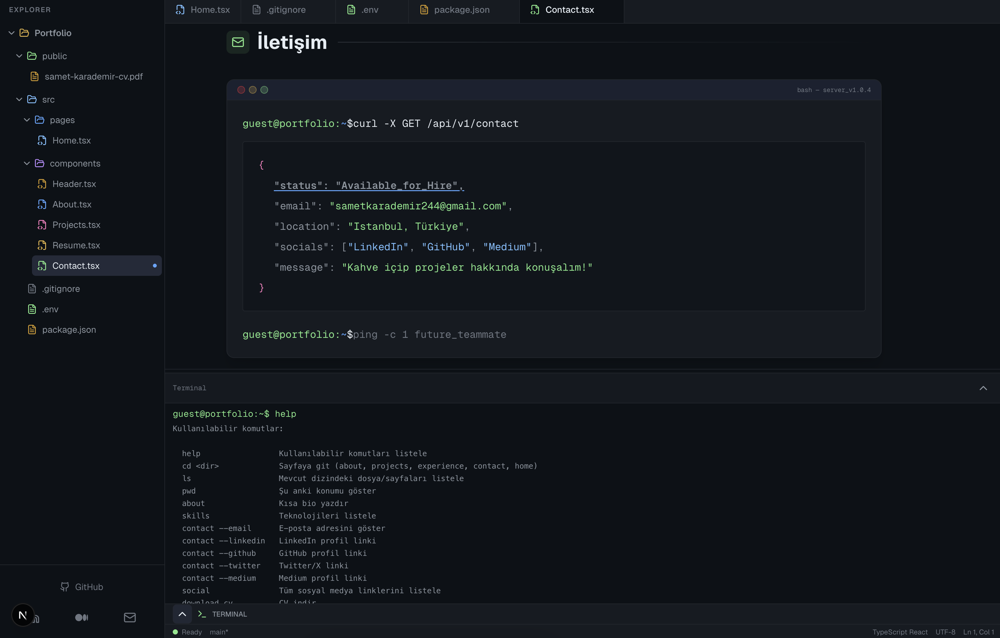

# Portfolio — VS Code–style Resume Site

A personal portfolio built with Next.js that mimics a VS Code–like interface: file explorer sidebar, tabbed content, and an interactive terminal. Sections (About, Projects, Experience, Contact) are navigable via sidebar or terminal commands (`cd`, `ls`, `pwd`, `help`, etc.).



## Tech Stack

- **Next.js 16** (App Router) · **React 19** · **TypeScript**
- **Tailwind CSS 4** for styling
- **Lucide React** for icons

## Setup & Run

Clone the repo and install dependencies:

```bash
git clone <repository-url>
cd resume-nextjs-client
npm install
```

Run the development server:

```bash
npm run dev
```

Open [http://localhost:3000](http://localhost:3000) in your browser.

**Other commands:**

- `npm run build` — production build
- `npm run start` — run production server
- `npm run lint` — run ESLint

## Project Structure

- `src/app/` — App layout and main page
- `src/components/` — UI (sidebar, navbar, terminal, pages like About, Projects, Resume, Contact)
- `src/constants/` — Shared content and config
- `src/libs/` — Utilities (e.g. JSON syntax highlighting)
- `public/` — Static assets (images, CV)

Replace content, links, and CV in the codebase and `public/` to customize the portfolio for your own use.
